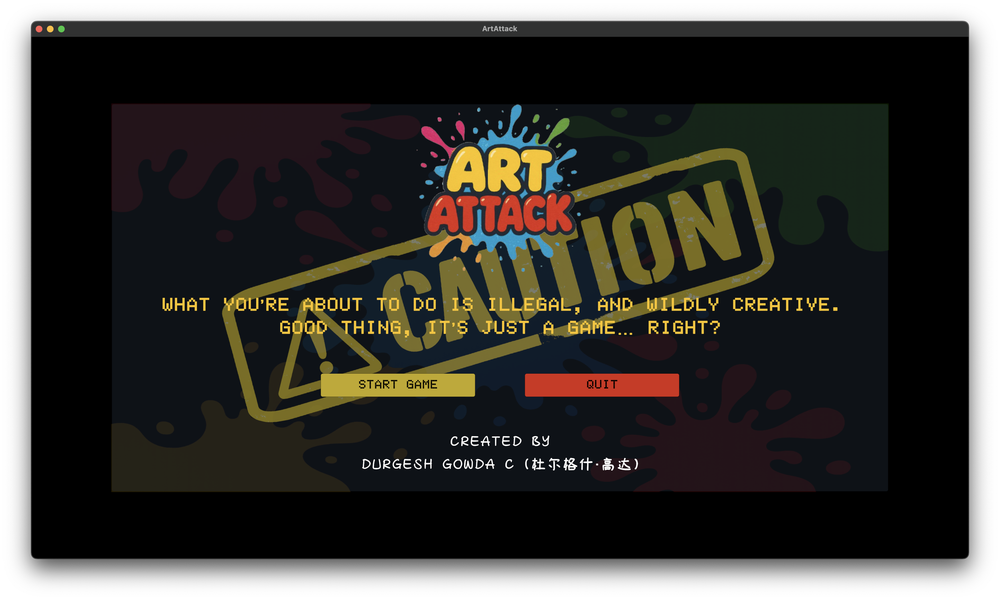

# 🎨 ArtAttack


### **Creativity isn't a crime… but be careful here.**

ArtAttack is a satirical, first-person art gallery vandalism simulator built in Unity. You're alone in a high-end exhibit, armed with paint and an uncontrollable urge to make things… messier.

<p align="center">
  
  
  
</p>

---

## 🕹️ Gameplay

Explore a pristine, stylized art gallery — then break the rules.

- 🎨 **Choose paint colors** from a dynamic palette
- 🖌️ **Adjust brush size** for fine details or bold strokes
- 🖼️ **Paint directly on gallery walls** with realistic splattering effects
- 🚶‍♀️ **Navigate** the gallery using standard FPS controls

But beware — your actions have consequences:
- 🚓 **Get caught** by security and face custom game-over screens
- 🔄 **Return to the main menu** to create new (illegal) masterpieces
- ⏰ **Time pressure** adds tension to your artistic rebellion

---

## 🚀 Features

### 🎨 Advanced Paint System
- **Color palette UI** with custom color selection
- **Dynamic brush size control** with real-time preview
- **Brush toggle system** for quick tool switching
- **Decal-based painting** on 3D surfaces for optimal performance
- **Real-time paint projection** using efficient decal rendering

### 💥 Polished UI/UX
- **Animated main menu** with typewriter text effects
- **Smooth UI transitions** and motion graphics
- **Responsive design** adapting to different screen sizes
- **Audio feedback** for walking

### 🖼️ Immersive 3D Gallery
- **Realistic gallery environment** with dynamic lighting
- **Interactive paintings** and sculptures
- **Multiple gallery rooms** to explore and vandalize
- **Randomized anti-vandal warnings** and educational messages

### 🌐 Accessibility & Localization
- **Multilingual support** (English and Simplified Chinese)
- **Colorblind-friendly** palette options
- **Adjustable UI scaling** for different screen sizes
- **Keyboard remapping** support

---

## 🧾 How to Play

### macOS Build (Available Now)
1. **Download** the latest release from [Releases](https://github.com/durgeshgowdac/ArtAttack/releases)
2. **Unzip** `ArtAttack.app.zip`
3. **Right-click** `ArtAttack.app` → **Open** (to bypass macOS Gatekeeper; you may need to confirm in System Settings > Security & Privacy)
4. **Start painting** the town red! 🎮

### Other Platforms
ArtAttack is currently available only as a macOS build. Developers can build for other platforms using the Unity Editor (see [Developer Setup](#-developer-setup)):

- **Windows/Linux**: Clone the repository and build using Unity Editor
- **WebGL**: Possible but may have performance limitations with the paint system
- **Mobile**: Not yet optimized for touch controls

### Controls
- **WASD** or **Arrow Keys** - Player Movement
- **C** - Crouch [Hold]
- **Left Shift** - Sprint [Hold]
- **Scroll Wheel** - Zoom In/Out
- **Mouse Movement** - Look Around
- **Left Mouse Click** - Paint on Walls

---

## 🧑‍💻 Developer Setup

This project is built with **Unity 6**.

### 🛠️ Getting Started

1. **Clone the repository:**
   ```bash
   git clone https://github.com/durgeshgowdac/ArtAttack.git
   cd ArtAttack
   git lfs install  # Ensure Git LFS is set up for large assets
   ```

2. **System Requirements:**
   - Unity 6 or newer
   - Git LFS (for large assets)
   - 8GB RAM recommended (4GB minimum)
   - Graphics card supporting DirectX 11 or Metal
   - 5GB free disk space
   - macOS 10.15+ (for macOS builds)

3. **Open in Unity Hub:**
   - Launch Unity Hub
   - Click "Add" and select the `ArtAttack` folder
   - Use the Unity version listed in `ProjectSettings/ProjectVersion.txt`
   - Wait for Unity to import all assets (may take 5-10 minutes for the first time)

4. **Install Dependencies:**
   - Unity will automatically import required packages
   - If prompted, install TextMeshPro essentials
   - Ensure Universal Render Pipeline (URP) is properly configured

5. **Open the main scene:**
   - Navigate to `Assets/Scenes/MainMenu.unity`
   - Press Play to test in the Unity Editor

### 🔧 Development Workflow

1. **Scene Organization:**
   - `MainMenu.unity` - Entry point with animated UI
   - `GamePlay.unity` - Main gameplay scene
   - `GameOver.unity` - End game state

2. **Testing in Editor:**
   - Use **Ctrl+P** (Windows) or **Cmd+P** (Mac) to play/pause
   - Enable Gizmos in Scene view for debugging
   - Use Console window to monitor debug logs

3. **Building the Project:**
   ```
   File → Build Settings
   - Add all scenes in correct order
   - Select target platform
   - Configure Player Settings (Company Name, Product Name, etc.)
   - Build and Run
   ```

---

## 📁 Project Structure

```
ArtAttack/
├── Assets/
│   ├── Prefabs/            # Reusable game objects
│   ├── Scenes/             # Unity scene files
│   ├── Scripts/            # C# gameplay scripts
│   ├── Settings/           # Project configuration
│   │   ├── URP/           # Universal Render Pipeline settings
│   └── Plugins/           # Third-party assets and tools
├── Packages/              # Unity Package Manager dependencies
├── ProjectSettings/       # Unity editor configuration
├── UserSettings/         # Local user preferences (git-ignored)
└── Builds/               # Output folder for compiled builds
```

---

## ⚙️ Key Scripts & Systems

### 🔍 Understanding the Paint System
The core painting functionality uses:
- **Raycast detection** to identify paintable surfaces
- **Texture blending** to apply paint in real-time
- **Mesh colliders** on gallery walls for precise hit detection
- **Custom shaders** for realistic paint appearance and dripping effects

### 🤖 Security AI System
The security system includes:
- **Line-of-sight calculations** using raycasting
- **Patrol routes** with waypoint navigation
- **Alert states** that escalate based on player behavior
- **Dynamic difficulty** that adjusts detection sensitivity

---

## 🌐 Localization System

### Current Languages
- **English** (Default)
- **Simplified Chinese** (简体中文)

---

## 🧪 Testing & Quality Assurance

### Manual Testing Checklist
- [ ] All UI elements respond correctly
- [ ] Paint system works on all gallery surfaces
- [ ] Security detection triggers appropriately
- [ ] Game over sequences play correctly
- [ ] Audio levels are balanced
- [ ] Performance maintains 30+ FPS on target hardware

### Performance Profiling
Use Unity's built-in Profiler (`Window → Analysis → Profiler`):
- Monitor CPU usage during painting
- Check memory allocation for texture operations
- Verify GPU performance with complex scenes
- Test loading times between scenes

### Build Testing
Always test builds on target platforms:
```bash
# Create development build for debugging
# Enable "Development Build" and "Script Debugging" in Build Settings
```

---

## 🚧 Known Issues & Roadmap

### Current Limitations
- **Limited Undo functionality** - No erase tool implemented yet
- **Performance on older hardware** - Optimization needed for integrated graphics
- **Platform availability** - Currently only available as a macOS build
- **Mobile support** - Not yet optimized for touch controls

### Planned Features
- [ ] **Cross-platform builds** (Windows, Linux, WebGL) - High Priority
- [ ] **Undo/Redo system** with paint history
- [ ] **Multiple brush types** (spray paint, markers, chalk)
- [ ] **Photo mode** to capture your vandalism
- [ ] **Leaderboards** for most creative destruction
- [ ] **Multiplayer mode** - collaborative vandalism
- [ ] **Custom gallery imports** - vandalize your own spaces

### Performance Optimizations
- [ ] **Texture atlasing** for reduced draw calls
- [ ] **LOD system** for distant gallery objects
- [ ] **Occlusion culling** optimization
- [ ] **Mobile rendering pipeline** adaptation

---

## 🤝 Contributing

We welcome contributions from artists, developers, and vandalism enthusiasts!

### How to Contribute

1. **Fork the repository:**
   - Navigate to [https://github.com/durgeshgowdac/ArtAttack](https://github.com/durgeshgowdac/ArtAttack)
   - Click the "Fork" button on GitHub to create your own copy
   - Clone your fork:
     ```bash
     git clone https://github.com/YOUR_USERNAME/ArtAttack.git
     cd ArtAttack
     ```

2. **Create a feature branch:**
   ```bash
   git checkout -b feature/YourAmazingFeature
   ```

3. **Make your changes:**
   - Follow the existing code style
   - Add comments for complex logic
   - Test thoroughly in the Unity Editor
   - Update documentation if needed

4. **Push to `develop` branch:**
   - Base your pull request on the latest `develop` branch:
     ```bash
     git fetch origin
     git checkout develop
     git pull origin develop
     git checkout feature/YourAmazingFeature
     git rebase develop
     ```
   - Push your changes and open a PR targeting `develop` (not `main`):
     ```bash
     git push origin feature/YourAmazingFeature
     ```
   - Open a Pull Request on GitHub

5. **Write clear commit messages:**
   - Use descriptive messages (e.g., "Add undo functionality to paint system")

### Code Style Guidelines
- Use **PascalCase** for public methods and properties
- Use **camelCase** for private fields and local variables
- Add **XML documentation** for public APIs
- Organize using statements alphabetically
- Limit line length to 120 characters

### Art Contribution Guidelines
- **3D Models:** Use .fbx format, keep polycount reasonable
- **Textures:** Power-of-2 dimensions, use compression
- **Follow Unity naming conventions** for imported assets

---

## 📄 License

This project is licensed under the **MIT License** - see the [LICENSE](LICENSE) file for details. Third-party assets (e.g., TextMeshPro, Universal Render Pipeline) are subject to their respective licenses.

### Third-Party Assets
- **TextMeshPro** - Unity Technologies (included with Unity)
- **Universal Render Pipeline** - Unity Technologies
- **Mini First Person Controller** - Simon Serge Pasi
- **Gallery Models** - Created specifically for this project

---

## 🧑‍🎨 Credits & Acknowledgments

**Built with ❤️ and rebellious spirit in Unity**

### Development Team
- **@durgeshgowdac** - Lead Developer, Game Designer
- **Special Thanks** to the Unity community for resources and inspiration

### Beta Testers
Thanks to our brave early vandals who helped refine the experience!

### Artistic Inspiration
- Lee Bae’s monochromatic works and exploration of materiality through charcoal
- Classic art gallery experiences that needed more chaos
- Street art culture and creative rebellion
- Games that let players break the rules in creative ways

---

## 📞 Support & Community

### Getting Help
- **GitHub Issues** - Report bugs and request features

### Showcase Your Art
Created something amazing (or beautifully terrible)? Share it!
- Take screenshots and share them via [GitHub Issues](https://github.com/durgeshgowdac/ArtAttack/issues) or on social media with #ArtAttackVandalism

### Educational Use
Teachers and educators: ArtAttack can be used to discuss:
- Art history and gallery culture
- Digital art and game development
- Ethics of public art and vandalism
- Creative expression vs. property rights

**Remember: This is satire! Always respect real art and property.**
